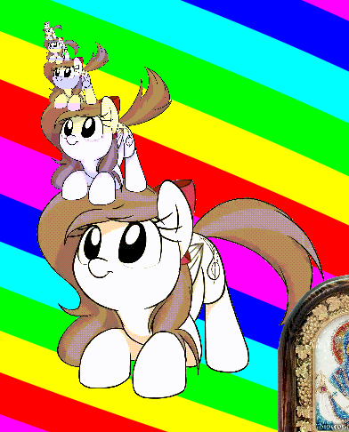

                      Controls
---------------------------------------------------
Mouse drag&nbsp;&nbsp; = move  
Double click = disable/inable float over all widows  
Triple click = close  

                      Configure
---------------------------------------------------
frame_size.txt&nbsp;&nbsp;&nbsp;&nbsp;&nbsp; = rendered image scale [0-infty]  
frame_delay.txt&nbsp;&nbsp;&nbsp;&nbsp; = delay between animation frames  
source_location.txt = source images location folder  
source_type.txt&nbsp;&nbsp;&nbsp;&nbsp; = gif/image/image_set/frame_set  
image_set - creates bunch of windows each window for each image  
frame_set - creates animation from frames  
image&nbsp;&nbsp;&nbsp;&nbsp; - shows single image  
gif&nbsp;&nbsp;&nbsp;&nbsp;&nbsp;&nbsp; - splits input gif file into frames  
  
